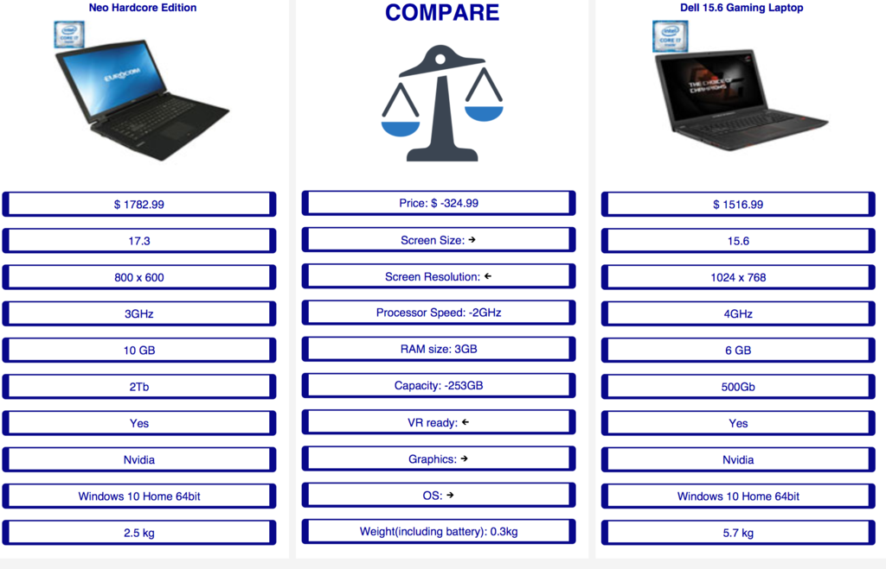

# NodeNodes
A project created to test cooperative software development practices.

Does not pursue any goals in particular. At first, we were making a car. Then they said it should be an airplane.
Then we did market analysis and figured out that boats are more profitable than airplanes.

In the end, we ended up with a bicycle.

Now it's the time for pictures:

